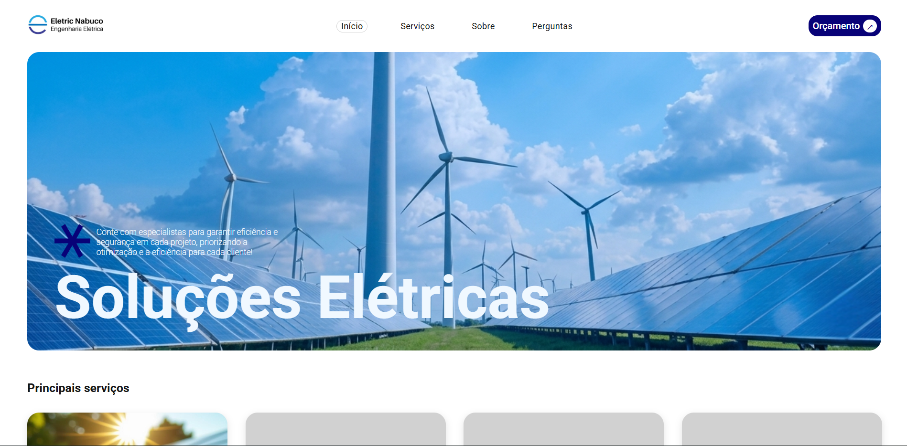

# Site Institucional Eletric Nabuco

<p align="center">
  
</p>

**Meu primeiro projeto como freelancer**

Landing page institucional desenvolvida para uma empresa de engenharia elétrica, com foco em apresentação de serviços, fortalecimento da marca e geração de novos clientes.

---

##  Sobre o projeto

Este projeto foi desenvolvido como minha **primeira experiência profissional como desenvolvedor**, atendendo a uma demanda real de cliente.

O objetivo foi criar uma presença digital moderna, clara e eficiente, destacando os principais serviços da empresa e incentivando o contato para orçamentos.

---

##  Desafios enfrentados

Durante o desenvolvimento, trabalhei com:

- Organização de layout profissional
- Responsividade (desktop e mobile)
- Experiência do usuário (UX)
- Estruturação de seções estratégicas (serviços, sobre, FAQ, CTA)
- Primeira experiência lidando com requisitos de cliente real

---

##  Tecnologias utilizadas

- HTML5
- CSS3
- JavaScript
- jQuery
- Swiper.js 

---

##  Funcionalidades

- Menu responsivo (desktop e mobile)
- Banner inicial com destaque de serviços
- Carrossel interativo com Swiper.js
- Seção "Sobre" institucional
- Apresentação de equipe
- FAQ com efeito acordeão
- CTA para solicitação de orçamento
- Footer com informações e redes sociais

---

##  Como executar o projeto

```bash
# Clone o repositório
git clone https://github.com/seu-usuario/eletric-nabuco

# Acesse a pasta
cd eletric-nabuco

# Abra no navegador
index.html